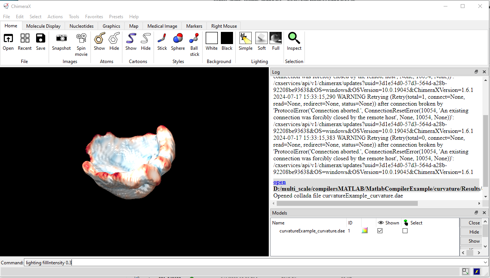

=======================
Cell Curvature Analysis
=======================

Cell curvature is an important morphological feature of cell shape and involved
in organizing cell signaling (e.g. through `Septin localization <https://www.pnas.org/doi/full/10.1073/pnas.2208253120>`_.

To measure and visualize cell curvature, we developed custom Matlab code
that takes a binary cell segmentation mask, measures the curvature, and
generates a collada (.dae) file for visualization.
The collada file format can be easily imported (opened) in ChimeraX:
https://www.cgl.ucsf.edu/chimera/.

Matlab code
===========

If you run the Matlab, please first add the Matlab folder Highres_curvature to your active
`Matlab search path <https://www.mathworks.com/help/matlab/ref/addpath.html>`_. Next,

Matlab compiled version
=======================

If you do not have access to Matlab, we provide a compiled version of the code as ".exe" file.
To run it, please double click on the compiled version and follow the installation instructions.
In the installation process also a `Matlab runtime <https://www.mathworks.com/products/compiler/matlab-runtime.html>`_
environment is installed to run the code (if not already available).
After installation, the compile code is ready to run. For this, click on MatlabCompiler_measureCurvature.exe to run
the code and follow the prompts to select a .tif file.

Output:

The Matlab file generates an Excel file with all the vertices of the surface mesh (meshSurface.xlsx),
an Excel file with the mean and Gaussian curvature values (Curvature.xlsx) and the collada file for
rendering in Chimera (see image below).

.. code-block:: none

    .
    |-- curvaturefolder
    |   |-- curvatureExample.tif
    |   |   Results
    |   |   |   |--meshSurface.xlsx
    |   |   |   |--Curvature.xlsx
    |   |   |   |--curvatureExample_curvature.dae

Test data for cell curvature analysis
=====================================

Test data is available for the cell shape feature analysis on Synapse in the folder
Code_Example_Datasets/Exemplary_CurvatureAnalysis:

LINK

It contains a segmented cells to visualize.

